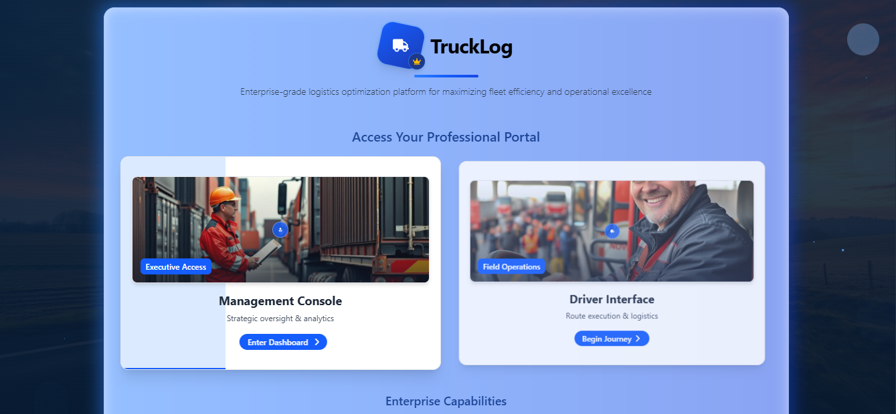
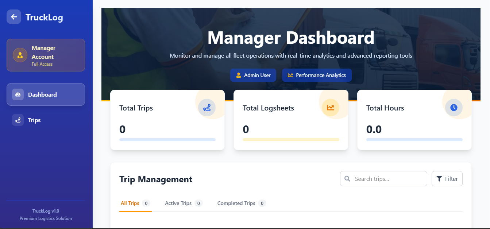
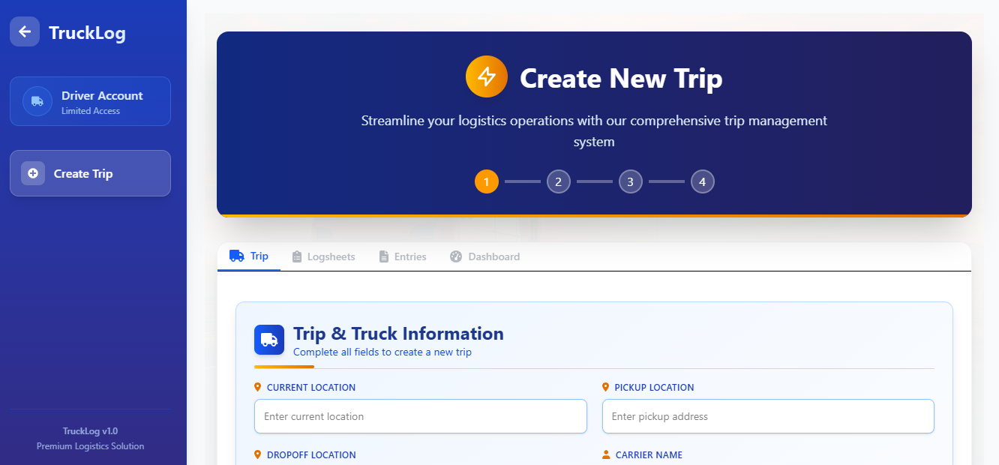

# Trip Management App

This is a fullstack truck management application for managing trips, trucks, drivers, logsheets, and entries. The backend is built with **Django**, and the frontend is built with **React** using **Tailwind CSS**.

---

## Overview

The Trip Management App is designed to help trucking companies manage their trips efficiently. The application allows managers and drivers to track trips, manage logsheets, add entries, and generate PDF reports for trips.

---

## Features

### Home Page
- Users are asked to select their role: **Manager** or **Driver**.

### Manager
- Can view **all trips** in the system.
- Can see **detailed trip information** including:
  - Current location
  - Pickup & dropoff locations
  - Vehicle details
  - Cycle used
  - Logsheets and entries
- Can **download a PDF** of trip details for record-keeping.

### Driver
- Can **create new trips**.
- Can **add logsheets** for daily driving.
- Can **add entries** to logsheets including:
  - Status
  - Start time
  - End time
  - Location
  - Notes
- Can view **trip history** and update entries.

---

## Tech Stack

- **Backend:** Django, Django REST Framework
- **Frontend:** React, Tailwind CSS, React Icons
- **Database:** SQLite (can be switched to PostgreSQL for production)
- **Deployment:** Vercel (Frontend) & Render/Railway (Backend)
- **Others:** Axios for API requests, jsPDF for PDF generation

---

## Installation

### Backend Setup

1. Navigate to the backend folder:
    ```bash
    cd backend
    ```
2. Create a virtual environment:
    ```bash
    python -m venv venv
    source venv/bin/activate  # Linux/Mac
    venv\Scripts\activate     # Windows
    ```
3. Install dependencies:
    ```bash
    pip install -r requirements.txt
    ```
4. Run migrations:
    ```bash
    python manage.py makemigrations
    python manage.py migrate
    ```
5. Start the backend server:
    ```bash
    python manage.py runserver
    ```

### Frontend Setup

1. Navigate to the frontend folder:
    ```bash
    cd frontend
    ```
2. Install dependencies:
    ```bash
    npm install
    ```
3. Start the development server:
    ```bash
    npm start
    ```

---

## Usage

1. Open the frontend app in your browser.
2. Select your role (Manager or Driver).
3. Depending on the role:
   - **Manager:** Browse trips, view details, and download PDF reports.
   - **Driver:** Create trips, add logsheets and entries, and track trips.

---

## Screenshots




---

## Live Demo

- Frontend live link: [https://trip-management-rho.vercel.app/](https://trip-management-rho.vercel.app/)
- Backend API live link: [https://trip-management-production.up.railway.app/api/trips/](https://trip-management-production.up.railway.app/api/trips/)

---
